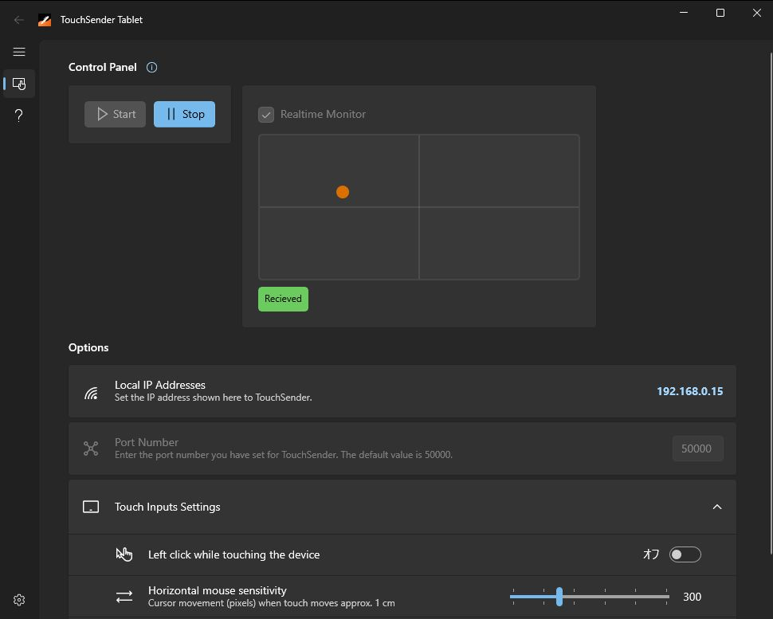

#  TouchSenderTablet

This software emulates mouse operations on Windows, using the touch status transmitted from the application [TouchSender](https://github.com/voltaney/touch-sender).

## Installation

Before installing, ensure that you have [TouchSender](https://github.com/voltaney/touch-sender) app installed on your device.

1. Download the latest release from the [GitHub Release Page](https://github.com/voltaney/TouchSenderTablet/releases).
2. Extract the downloaded zip file to a location of your choice.
3. Run the executable file (`TouchSenderTablet.exe`) to launch the application.

## Features

- Operation based on touch input with up to 1000Hz sensitivity
- Customizable mouse sensitivity
- Left-click functionality while touching
- Touch input status monitor

## Examples

### Spin Rhythm XD

https://github.com/user-attachments/assets/2acf9f1d-42dd-42c2-a63c-a2d8ba15cc77

## Deployment

1. Create a new release based on `release-drafter`.
1. When the version tag (e.g., `v1.0.0`) is added, the GitHub Actions workflow for the release is triggered.
1. The workflow builds the application (e.g., `.exe` file) and attaches it to the release.

## Development

Currently, the project only supports unpackaged builds.
